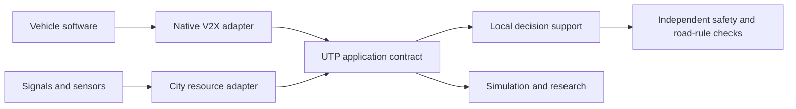

# Universal Traffic Protocol · v0.1

**Status: research draft, 1 October 2026.** UTP is an open application contract for experiments in cooperative mobility. The included JSON profile, examples, and receiver checks can be implemented today in a simulator or a laboratory. This release has no certified radio, security binding, controller integration, or public-road safety case.

## The idea in everyday language

Imagine a city in which the useful things already known by one participant can help another. A car says, “I intend to slow down.” A crossing sensor says, “A person is waiting here.” A traffic signal says, “This movement is red.” A parking sensor says, “This space was available a moment ago.” They speak a common language even when their manufacturers are different.

The original ambition began with a question at age seven: could everything involved in traffic communicate, so the city stops wasting time? This project turns that question into a testable proposal. Sharing a small amount of timely, relevant information could reduce avoidable braking, empty green time, parking searches, and uncertainty at merges. An open contract could make that coordination accessible beyond a single vehicle company.

More adoption creates more opportunities to coordinate, but the relationship is not a guarantee of steadily improving traffic. Road capacity, pedestrian crossings, demand, incidents, equipment reliability, and the quality of the coordination policy remain real constraints. We measure the benefit and its limits together.

**Working name.** Universal Traffic Protocol is retained as the project's name and UTP as its abbreviation. Use the full name in discovery and documentation: the unrelated BitTorrent transport µTP/uTP already exists. “Universal” expresses a goal of interoperability, rather than a claim that this draft fits every road or jurisdiction.

## 1. Scope and terminology

UTP adds a common application interface between vehicles, infrastructure, sensors, and mobility services. It is transport-independent and does not require sharing a vehicle's proprietary perception models, route planner, or driving software.

UTP v0.1 supports seven profiles:

| Profile                | Ordinary meaning                                   | Example                                                              |
| ---------------------- | -------------------------------------------------- | -------------------------------------------------------------------- |
| `presence`             | Here is my current state.                          | A connected car's position and speed.                                |
| `observation`          | Here is something my sensor observed.              | A roadside sensor sees a cyclist.                                    |
| `intent`               | Here is my tentative near-term plan.               | A vehicle expects to yield.                                          |
| `infrastructure_state` | Here is the state of a mapped city resource.       | Signal phase, stop rule, crossing occupancy, parking count, closure. |
| `coordination_offer`   | Here is a short-lived proposed arrangement.        | Two connected vehicles propose an ordering at a merge.               |
| `coordination_ack`     | I received that proposal and state my willingness. | Accept, decline, or cancel a proposal.                               |
| `capabilities`         | Here is the contract I understand.                 | Supported profiles, version, and simulation or laboratory operation. |

**MUST**, **MUST NOT**, **SHOULD**, and **MAY** describe requirements of this draft, not a certification scheme. A _receiver_ is an application accepting UTP data. A _gateway_ converts another message format into UTP. _Authority_ is a permission established by a configured trust policy; it is never established by a sender's own declaration.

A UTP observation is evidence. An intent is a prediction. An offer is advice. A message is never a substitute for the vehicle's local perception, collision avoidance, or applicable road rules. A pedestrian or manually driven vehicle MUST be able to use the road without participating in UTP.

## 2. Relationship to existing work

The broad field already has extensive work under vehicle-to-everything (V2X) and cooperative driving automation (CDA). [SAE J2735](https://saemobilus.sae.org/standards/j2735_202409-v2x-communications-message-set-dictionary) defines V2X message structures; [SAE J2945/1](https://saemobilus.sae.org/standards/j29451_202603-board-system-requirements-v2v-safety-communications) specifies requirements for a DSRC-based vehicle safety communication system using J2735 BSMs. ETSI specifies [CAM](https://www.etsi.org/deliver/etsi_en/302600_302699/30263702/01.04.01_60/en_30263702v010401p.pdf), [DENM](https://www.etsi.org/deliver/etsi_en/302600_302699/30263703/01.03.01_60/en_30263703v010301p.pdf), and [collective perception](https://www.etsi.org/deliver/etsi_ts/103300_103399/103324/02.01.01_60/ts_103324v020101p.pdf). These are substantial foundations, not missing inventions.

UTP's proposed contribution is a free, readable contract, reference fixtures, and an accessible experimental environment connecting those ideas to ordinary city resources and explicit fallbacks. Gateways are a research direction. There is no implemented J2735 or ETSI adapter in this release, and conceptual similarity is not wire compatibility. [The standards map](standards.md) records candidate mappings, translation losses, and verified sources.



An actual implementation may use a local radio or an IP transport. A cloud service is not required for neighboring participants to exchange information. This repository implements the educational simulation; the diagram describes a target architecture.

## 3. Encoding and envelope

The reference interchange format is UTF-8 JSON validated against [the schema](../protocol/schema.json), JSON Schema Draft 2020-12. Each message MUST be one JSON object, no greater than 32,768 UTF-8 bytes before parsing. Parsers MUST reject duplicate object keys, non-finite numbers, invalid UTF-8, and nesting greater than 16 levels. JSON Schema alone does not enforce those parser requirements.

The envelope is common to every profile:

```json
{
  "utp": "0.1",
  "type": "presence",
  "message_id": "sim-presence-000001",
  "sender": { "session_id": "sim-car-07", "kind": "vehicle" },
  "sequence": 1,
  "sent_at_ms": 1790856000000,
  "ttl_ms": 1000,
  "clock_uncertainty_ms": 5,
  "scope": {
    "center": {
      "lat": 41.881,
      "lon": -87.629,
      "horizontal_uncertainty_m": 0.5
    },
    "radius_m": 250
  },
  "security": { "binding": "simulation" },
  "body": {
    "position": {
      "lat": 41.881,
      "lon": -87.629,
      "horizontal_uncertainty_m": 0.5
    },
    "speed_mps": 8.5,
    "speed_uncertainty_mps": 0.2,
    "heading_deg": 90,
    "heading_uncertainty_deg": 2,
    "length_m": 4.5,
    "width_m": 1.9
  }
}
```

| Field                  | Contract                                                                                                       |
| ---------------------- | -------------------------------------------------------------------------------------------------------------- |
| `utp`                  | Exact contract version. This release accepts `0.1`.                                                            |
| `type`                 | Profile discriminant; it determines body schema and lifetime ceiling.                                          |
| `message_id`           | Unique within the sender session; retrying the same message preserves it.                                      |
| `sender.session_id`    | Random, short-lived identifier; MUST NOT be a VIN, plate, account, or durable personal ID.                     |
| `sender.kind`          | `vehicle`, `infrastructure`, `sensor`, or `service`; a claim, not authenticated authority.                     |
| `sequence`             | Increasing non-negative integer across all profiles in this sender session. No wrap in a session.              |
| `sent_at_ms`           | Unix UTC milliseconds. In a simulation, a documented virtual epoch is permitted.                               |
| `ttl_ms`               | Maximum useful lifetime from `sent_at_ms`; retransmission does not restart it.                                 |
| `clock_uncertainty_ms` | Conservative absolute bound on the sender's clock error. Unknown clock quality is not zero.                    |
| `scope`                | WGS84 circular geographic relevance area, rather than a route or personal destination.                         |
| `security`             | Binding declaration. `simulation` has no authenticity. `external` requires a verifier configured outside JSON. |
| `origin`               | Optional provenance of translated data: standard/format, edition, and source message reference.                |
| `body`                 | One profile-specific object.                                                                                   |

Identifiers contain ASCII letters, digits, `.`, `_`, `:`, or `-`, with 8–128 characters. Resource IDs are locally meaningful identifiers, not globally unique addresses; they are interpreted with `map_ref.namespace`, `map_ref.map_id`, and `map_ref.revision`. Every profile rejects unknown fields in v0.1. An extension requires a new version or a separately registered profile; silently discarding an unknown safety-relevant field is not negotiation.

The `origin` field records lineage only. A gateway MUST NOT claim the original sender's authority using its own signature. It MUST keep the original age, uncertainty, permissions, and validity limits, and SHOULD retain authenticated source bytes in its laboratory trace. v0.1 does not define cryptographic origin attestations.

## 4. Units, geography, and uncertainty

Latitude and longitude are WGS84 decimal degrees. Positive longitude is east. Optional altitude is meters above the WGS84 ellipsoid and requires `vertical_uncertainty_m`. Heading is degrees clockwise from true north in `[0, 360)`. Speed is meters per second and non-negative. Dimensions and scope radius use meters.

`horizontal_uncertainty_m`, `speed_uncertainty_mps`, and `heading_uncertainty_deg` are conservative absolute bounds used by the laboratory model, not probability claims. A number of zero means a deliberately exact synthetic value, not a field estimate. Bounds MUST include calibration and transformation error. If a sensor has only a statistical estimate, a gateway MUST document its conversion and confidence level; it MUST NOT present a 95% confidence ellipse as a guaranteed error bound.

`confidence` on an observation is either a documented, calibrated probability in `[0,1]` or `null` when uncalibrated. It does not replace a spatial error bound or establish trust. Receivers MUST NOT assume the confidence numbers of different sensor products are comparable.

For prediction over time `t`, the receiver SHOULD propagate spatial uncertainty, speed error, clock error, and an application-specific acceleration bound. As a deliberately simple illustration, a longitudinal margin may include `position_error + speed_error × t + 0.5 × acceleration_bound × t² + speed × clock_error`. This expression is not a collision-avoidance algorithm. An operational safety case needs a full model of orientation, dimensions, localization faults, and correlated observations.

Lane and resource references are valid only for the exact map revision stated. Receivers MUST NOT use an unresolved or mismatched map reference to allocate an intersection movement. v0.1 does not distribute lane geometry; use an explicit laboratory fixture. A future gateway may translate a native MAP message with preserved identifiers and revision semantics.

## 5. Profiles and their semantic checks

The schema enforces structure and ranges. A conforming experimental receiver MUST also enforce the cross-field and receiver-state checks below. Passing schema validation means “well formed,” not “safe,” “true,” or “accepted.”

### 5.1 Presence

Required: `position`, `speed_mps`, `speed_uncertainty_mps`, `heading_deg`, `heading_uncertainty_deg`, `length_m`, `width_m`. Optional: `automation` and `map_ref`.

A presence message describes the sender at `sent_at_ms`. It MUST NOT identify nearby unequipped participants as senders; use observations for them. `automation` is descriptive and does not imply a capability to accept coordination. Silence MUST NOT be interpreted as an empty road.

### 5.2 Observation

Required: `observed_at_ms`, `subject_id`, `category`, `position`, `status`, `confidence`. Optional: speed and speed uncertainty as a pair, and `map_ref`. Categories include `vehicle`, `pedestrian`, `cyclist`, `obstacle`, `queue`, and `parking_space`. `subject_id` is scoped to the reporting session; it is not a cross-sensor identity.

The observation time MUST NOT be later than `sent_at_ms` beyond declared clock uncertainty. The observation MUST expire no later than `observed_at_ms + ttl_ms`; wrapping an old observation in a new envelope cannot refresh it. Receivers MUST apply freshness to the observation time as well as the envelope time.

`available` and `occupied` are allowed only for `parking_space`. All other categories use `detected`, `blocked`, or `unknown`. `available` is a recent sensor reading, not a reservation. `unknown` is uncertainty, not an assertion of absence. Correlated or retransmitted observations MUST NOT count as independent corroboration.

### 5.3 Intent

Required: `plan_id`, `maneuver`, `horizon_ms`, and `trajectory`. Each trajectory point contains `offset_ms`, `position`, and `speed_mps`. At least two and no more than 32 points are permitted.

Offsets MUST strictly increase, start at zero, and end at `horizon_ms`; the horizon is at most 10 seconds. Time is relative to the envelope's `sent_at_ms`. Intent MUST be refreshed or abandoned when a plan materially changes. Its validity is bounded by the envelope lifetime even if its prediction horizon is longer. A receiver MUST treat a predicted path as tentative and expand its uncertainty over the horizon. No receiver may rely on intent as a promise that a vehicle will execute that path.

### 5.4 Infrastructure state

Required: `resource_id`, `map_ref`, `observed_at_ms`, `authority_claim`, and `state`. `observed_at_ms` is the source measurement or confirmation time. The observation-age and future-time rules from §5.2 apply: republishing a stale city feed cannot make it current. The state object has one kind:

| Kind        | Required state fields                                           | Interpretation                                                                                            |
| ----------- | --------------------------------------------------------------- | --------------------------------------------------------------------------------------------------------- |
| `signal`    | `signal_group_id`, `phase` (`stop`, `caution`, `go`, `unknown`) | Current movement indication. Optional `min_end_ms` and `max_end_ms` are a pair giving an estimated range. |
| `stop_sign` | `rule: "stop"`                                                  | A mapped static stop rule. Broadcasting it does not remove the stop.                                      |
| `parking`   | `capacity`, `occupied`                                          | `0 ≤ occupied ≤ capacity`; available count is derived.                                                    |
| `crosswalk` | `occupancy` (`occupied`, `clear`, `unknown`)                    | Sensor state; `clear` never removes a pedestrian's right to cross.                                        |
| `closure`   | `status` (`open`, `closed`, `unknown`)                          | Current resource availability, subject to authority and local restrictions.                               |

`authority_claim` is `controller` or `observer`. An observer may report a signal reading, but cannot set or authorize a signal. A receiver MUST resolve an authenticated controller's permissions against the stated resource and map revision before treating its report as authoritative. Two conflicting authorized reports cause the application to mark the resource unknown and fall back; “last message wins” is not an authority policy.

Signal end bounds MUST be ordered and MUST NOT predate `sent_at_ms` beyond clock uncertainty. They are predictions; an actuated signal may change. A controller adapter MUST preserve pedestrian clearance, conflicting movement interlocks, minimum green, yellow, and all-red timing. The browser simulation's green-wave policy does not implement a signal controller or those interlocks.

### 5.5 Coordination offer

Required: `offer_id`, `resource_id`, `map_ref`, `participants`, `valid_from_ms`, `valid_until_ms`, and `slots`. A slot contains `participant`, `enter_after_ms`, and `exit_before_ms`. Times are absolute Unix milliseconds. Offers contain 2–8 unique participants and 2–8 slots.

The offer's sender MUST be one of its participants. Each participant MUST have exactly one slot. Slots MUST have `enter_after_ms < exit_before_ms`, lie inside the offer interval, and MUST NOT overlap. `valid_from_ms < valid_until_ms ≤ sent_at_ms + ttl_ms`. An offer MUST be rejected when `received_at_ms + receiver_clock_uncertainty_ms + sender_clock_uncertainty_ms ≥ valid_until_ms`, even when its envelope TTL has not expired. The entire arrangement is short-lived; this profile's TTL ceiling is two seconds.

This is a deliberately limited advisory ordering at one laboratory conflict resource, with no assumption about road capacity. It is not an intersection reservation or a distributed transaction. Receivers MUST decline if the map, peers, uncertainty margins, trust, deadline, legal permission, or local perception are insufficient. Offers MUST NOT include unequipped people as consenting participants. Waiting for an acknowledgement MUST NOT delay an immediate local safety response.

### 5.6 Coordination acknowledgement

Required: `offer_id`, `offer_sender_session_id`, `offer_message_id`, `decision` (`accepted`, `declined`, `cancelled`), and `reason`. Reasons are `willing`, `conflict`, `unsupported`, `uncertain`, `expired`, `local_override`, or `other`.

The acknowledgement sender MUST be a participant in the referenced offer. A receiver MUST match the offer's sender session and both offer identifiers, and MUST possess an unexpired offer. It MUST apply the offer's absolute deadline using both the receiver's and the offer sender's clock uncertainties, in addition to checking the acknowledgement envelope. A duplicate acknowledgement is idempotent. An acknowledgement to an unknown or expired offer MUST be ignored.

`accepted` means willingness to use the proposal as planning advice while all local conditions continue to hold. It does not confer right of way. It MUST use reason `willing`; other decisions MUST NOT. Every participant must express willingness before the demonstration treats the offer as mutually accepted. Until then, everyone follows their independent fallback behavior. Expiry, cancellation, conflicting offers, lost freshness, or local override invalidates the arrangement. v0.1 has no atomic commit or failure-tolerant execution guarantee.

### 5.7 Capabilities

Required: `supported_versions`, `supported_profiles`, `max_message_bytes`, and `operating_mode` (`simulation` or `laboratory`). Optional: `adapters` listing standard/format names an implementation claims to translate.

Lists MUST contain unique values. Advertising support does not prove conformance or performance. Peers MUST select an explicitly supported common version before exchanging offers. If no common version or profile exists, the receiver MAY use a supported awareness profile and MUST keep independent operation. A failed authenticated exchange MUST NOT trigger acceptance of an unsigned equivalent.

## 6. Lifetime and receiver algorithm

These are conservative limits for this **laboratory JSON profile**, chosen to make experiments explicit. They are not derived radio performance requirements or validated safe operating bounds.

| Profile / state          | TTL ceiling | Suggested demonstration publishing rate |
| ------------------------ | ----------: | --------------------------------------- |
| Presence                 |    1,000 ms | Up to 10 Hz when moving                 |
| Observation              |    1,000 ms | On change, with refresh while relevant  |
| Intent                   |    2,000 ms | On change; refresh as needed            |
| Signal / crosswalk state |    1,000 ms | Up to 10 Hz; on change                  |
| Parking / closure state  |   10,000 ms | On change; refresh before expiry        |
| Stop rule                |   60,000 ms | On change; refresh before expiry        |
| Offer / acknowledgement  |    2,000 ms | Event driven; bounded retries           |
| Capabilities             |   60,000 ms | On joining and material change          |

The receiver uses its receipt timestamp `r` and conservative clock-error bound `u_r`; the envelope gives `s`, sender bound `u_s`, and lifetime `L`:

```text
age_upper    = r - s + u_s + u_r
future_upper = s - r + u_s + u_r
accept time only if age_upper < L and future_upper <= 100 ms
```

At exactly expiry, reject. The 100 ms future tolerance is a laboratory profile constant, not permission to omit synchronization. If either clock bound is unknown, or their sum exceeds 100 ms, the receiver MUST reject time-sensitive application use. A simulation may use a shared virtual clock and zero uncertainty. Observation and infrastructure-state freshness repeat the calculation using `observed_at_ms`. A mapped static stop rule remains independently applicable when its network message expires.

A conforming receiver processes each message in this order:

1. Enforce byte, nesting, UTF-8, duplicate-key, and rate budgets before expensive processing.
2. Validate exact version, profile, envelope, and body against the schema.
3. In laboratory mode, verify the configured external security binding and permissions. Simulation messages MUST be rejected outside an explicitly isolated simulation channel. A string such as `credential_ref` does not perform verification.
4. Apply envelope and observation freshness, clock quality, and geographic relevance. Use scope plus location uncertainty; an uncertain scope must not be made smaller by rounding.
5. Verify map revision and the semantic constraints in §5. Mark conflicting authoritative resource state unknown.
6. Check replay state keyed by **verified credential/session**, never a freely claimed session ID alone. Within a simulation it is keyed by the isolated simulator sender. Reject an already seen `message_id` and any `sequence` at or below the last accepted sequence. v0.1 intentionally drops reordered older messages.
7. Record the accepted sequence and message ID only after all preceding checks. Preserve replay state for at least 60 seconds after a session's last accepted message, with bounded cache sizes. On cache pressure, reject new coordination use and fall back rather than evicting active replay protection silently.
8. Pass the data to an application policy, which performs its independent perception, legal, fairness, and feasibility checks. Refresh expiry during use; acceptance at receipt is not permanent validity.

Signature success authenticates a source and its permissions, not the truth of the measurement. An attacker may have a valid credential; receivers still need plausibility checks, fault detection, misbehavior handling, and local override. Expiry and sequence checks do not prevent Sybil attacks or a dishonest sender opening new sessions.

## 7. Trust, privacy, and graceful fallback

v0.1 intentionally introduces no new cryptography. A future on-road binding must specify exact secured bytes, signature and certificate formats, authorization, revocation, replay identity, freshness, and verifier behavior using the applicable V2X security ecosystem. [USDOT's SCMS procurement guidance](https://its.dot.gov/pcb/documents/SCMS_Procurement_Resource_FHWA-JPO-21-862_v508.pdf) describes a credential management system's role in deployment; that is a system and governance problem as well as a field in a message.

`security.binding: "external"` means a laboratory application has separately configured a verifier for the entire envelope. It MUST NOT mean “trust this JSON because it says external.” Until a byte-level binding is standardized here, independent implementations cannot claim authenticated UTP interoperability. A transport connection using TLS alone also does not establish a road operator's permissions.

The receiver MUST apply least privilege: a parking observer cannot issue signal authority, a vehicle cannot close a road, and a city service cannot command vehicle actuation through UTP v0.1. Authority is resource-specific, revision-specific, jurisdiction-specific, and time-bounded by externally configured policy.

Mobile senders SHOULD rotate session identifiers with their pseudonym credentials. Observation subject IDs, intents, and acknowledgement references can link sessions; implementations SHOULD rotate or terminate them together rather than publish a continuity bridge. Fixed infrastructure may have a durable resource identity, with an authorized and auditable operator. No profile needs a person's name, face, plate, account, full trip, or home address.

Data SHOULD stay within its relevance area. Default logs SHOULD keep aggregate outcomes and rejection reasons; raw trajectories and sensor traces need a stated purpose, short retention, access controls, and consent where applicable. Pseudonyms reduce linkability but do not make precise movement anonymous. Broadcast information can still be collected and correlated.

When messages fail verification, become stale, disagree, disappear, or use unsupported versions, participants MUST revert to independent operation under the applicable road rules. Absence of data is unknown. The city MUST continue to serve people who do not connect. Extra connectivity may add useful information; loss of that connectivity must not create a new permission to proceed.

## 8. What the congestion hypothesis actually predicts

The testable hypothesis is: **at a fixed demand and physical network, timely interoperable information plus a feasible, fair control policy can reduce avoidable delay relative to an otherwise comparable baseline.** Adoption is one experimental variable; it is not itself the policy.

For a mixed fleet, if `p` is the independently distributed connected share, the probability that both members of a random vehicle pair connect is `p²`. That is an intuition for one pairwise opportunity, not a traffic-benefit curve. Connected infrastructure can benefit equipped vehicles without requiring every neighboring vehicle to connect; a roadside sensor can report unequipped participants. Adoption clusters, unreliable links, and uneven deployment invalidate the simple independence assumption.

Every signalized network has a capacity budget. Green time for one conflicting movement is unavailable to another. Pedestrian clearance and safe headway consume time. Demand above a bottleneck's feasible service rate creates a growing queue even with perfect information. A network may shift congestion downstream or optimize one neighborhood at another's expense.

Long-term demand can change too. [Duranton and Turner's study of US cities](https://www.aeaweb.org/articles?id=10.1257/aer.101.6.2616) finds vehicle travel responding to added road capacity. Applying that result to protocol-enabled efficiency is an inference, not a result measured for UTP: cheaper or faster trips may attract trips that absorb some gain. Zero traffic is therefore an aspiration to scrutinize, not a demonstrated outcome.

Evaluate person-delay, including pedestrians, cyclists, transit passengers, and unconnected vehicles. Also measure throughput, queue spillback, stops, travel-time tail, access fairness, communication load, and rejection rate. Lower average vehicle delay alone is insufficient. Safety claims require their own methodology; “no collisions in this toy simulator” is not evidence of real-road safety.

## 9. Experiment and implementation plan

The first reference experiment is a deterministic, seeded comparison: identical network, arrivals, destinations, pedestrian events, and physical rules; change connectivity and the information-aware policy. Run both scenarios for the same duration. Include unfinished trips and queued arrivals instead of counting only completed trips. Report the seed, warm-up, demand, adoption, infrastructure coverage, latency, loss, expiry policy, and uncertainty assumptions.

An experiment suite should sweep adoption and demand rather than select one flattering scene. Include 0% adoption, mixed fleets, 100% adoption, disconnected infrastructure, congestion beyond capacity, dropped and delayed messages, invalid messages, conflicting authority, localization error, and forced local override. Repeat across seeds and report uncertainty in the estimated outcomes.

**Implemented contract:** JSON schema and fixtures for all seven profiles, plus a reference receiver guard in `src/protocol.ts`. The guard uses an injected schema validator and transport-provided trust context; it checks parsing budgets, duplicate keys, rate limits, lifetime, semantic constraints, relevance, map resolution, resource permission, and replay. Coordination support in this guard is limited to an isolated simulation with transport-assigned sender identities. Authenticated peer discovery and negotiation need a separate specified binding before laboratory coordination is enabled.

The guard does not arbitrate conflicting signal authorities, validate motion feasibility, verify signatures itself, or implement a multi-party execution state machine. Those remain application responsibilities or future engineering. **Demonstration:** a stylized browser traffic experiment using simplified vehicle and infrastructure behavior. **Future engineering:** native standards adapters, authenticated laboratory bindings, realistic traffic calibration, hardware-in-the-loop, independent interoperability tests, and scoped safety evaluation with infrastructure operators.

Before claiming a deployable standard, publish a threat model, test vectors for native security bindings, certified interoperability results where applicable, operating limits, governance, version lifecycle, an independent safety assessment, and a pilot with an accountable road operator. Free source code does not eliminate radios, maintenance, credentials, certification, or deployment costs.

## 10. Open collaboration

Contributions should make one of three things clearer: the shared language, the observable evidence, or the limits. Good first experiments include a parking-availability gateway, a crossing observation fixture, standards field mappings with explicit loss reports, and adversarial freshness/replay tests.

The contract should evolve through public issues and reviewed changes. Breaking changes require a new version, migration notes, and updated examples. The project is vendor-neutral and has no affiliation with vehicle manufacturers, SAE, ETSI, or USDOT. No manufacturer adoption or endorsement is claimed.
